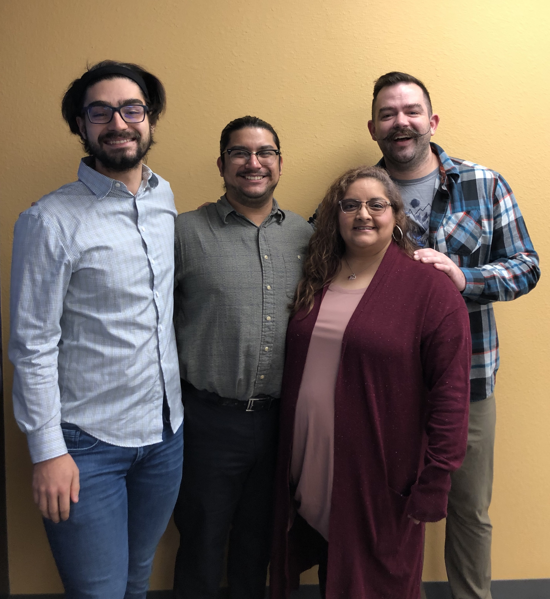
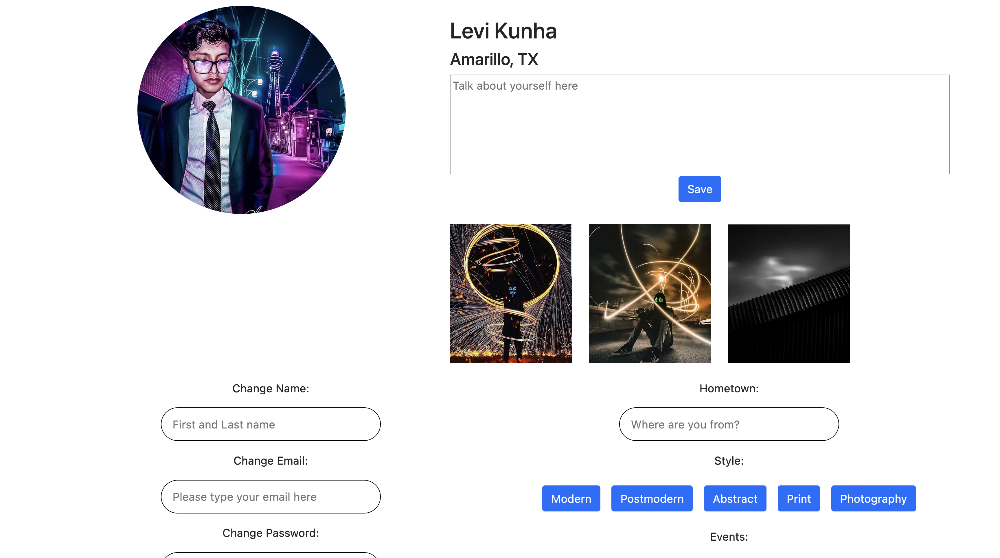
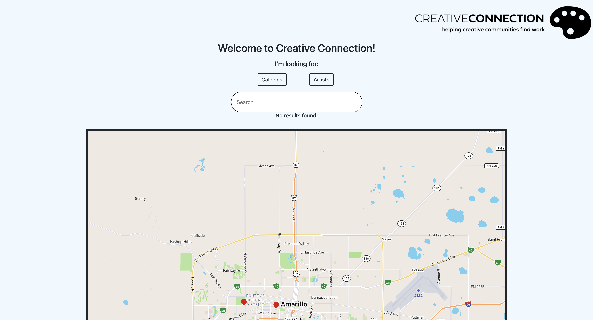

# AC Gallery Finder

I completed this project during my first semester with AC's web development program during which I served as a Teaching Assistant (TA) delivering supplemental instruction and helping students with their coding assignments and projects. At the end of the program, I joined a group of 3 students for their final project in order to increase my own knowledge and to gain insight into the student experience of final projects.

The website uses React, React Bootstrap, Redux, MySql, Express, and Node.
News about local art in Amarillo, TX is spread across various FaceBook pages,
so we built this site to help people find local artists, art galleries, and upcoming
events in one central place.

The site allows artists to log in, customize their profile, and upload pictures
that are representative of their work. 

Then, visitors can use the 
site's homepage to search through events and galleries created by the
artists. Here's a screenshot we got of the website during development:

I learned a ton from this project, and I couldn't be happier
to have worked with this awesome group.