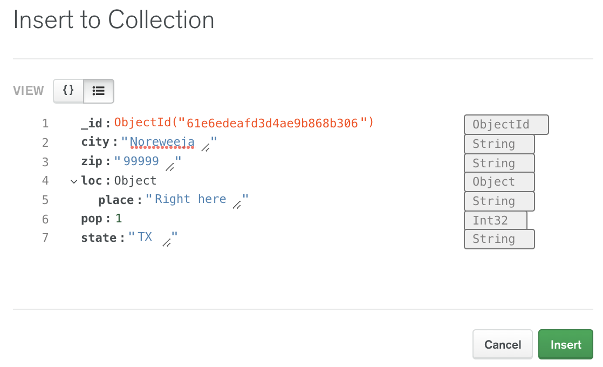

# MongoDB Problem Set #1: Intro to Mongo

--- 

In this problem set, we will exclusively use the Data Explorer,
a GUI provided by MongoDB Atlas. We will practice all the
CRUD operations (Create, Read, Update, and Delete).

If you have not already created a cluster and loaded the
sample dataset onto it, you will need to do so before continuing.

## Problem 1: Queries
On the main page of Atlas, find your cluster and click "Browse
Connections". Open the zips collection in the sample_training
database. Filter for all the documents describing zip codes
in Texas.

<details>
<summary>Hint</summary>

Remember that simple filters follow this format:
``` 
{ "field" : "value" }
```
</details>

<details>
<summary>Solution</summary>

Type this into the filter search bar. 
``` 
{ "state" : "TX" }
```
</details>

## Problem 2: Insert a New Document
In the zips collection, insert a new document
for a new made-up zip code. Take note of which zip 
code you choose, since we need it in the next
problem.

<details>
<summary>Solution</summary>

Please see the image below. You can insert new documents
in the object view or the text view. The text view is shown
below:



Generally, any document you insert should follow the 
same styling of the other documents in that collection.
The screenshot above is missing the correct fields nested
inside the loc object, but it should be enough to give you
the right idea. Remember to click the "Insert" button when you
are ready to insert the new document.
</details>

## Problem 3: Update a Document

Search for the document you just created and update it
to have a new int32 field called "wizard_population".

<details>
<summary>Solution</summary>

Find your document with the zip code you gave it in the
previous problem like this:
```
{ "zip" : "99999" }
```
Then, hover over the result and click on the pencil icon.
Use either the object view or the text view to add a new int32 field
named "wizard_population". Give it whatever value you want
</details>

## Problem 4: Delete a Document

Delete the document you just created by searching for
the number of wizards residing at that zip code.

<details>
<summary>Solution</summary>

Find your document with the zip code you gave it in the 
previous problem like this:
```
{ "wizard_population" : 22 }
```
Then, hover over the result and click on the trash can
icon that appears in the top right.
</details>


## Problem 5: Projection
We use projection to limit the fields shown on the
documents returned by or query. The projection is wrapped
in curly braces and comes inside the parentheses of `find()`.
1 means to include a field in the output, while
0 means to exclude a field in the output. Only 1 OR 0 can be
used in the same projection (with the only exception being the
"_id" field which can be set to 1 or 0 regardless of the projection).
Multiple fields can be included in a projection, so long as they
are separated by commas.

Projections can be created in the Data Explorer by clicking on the
"Options" button in the filter search bar.

1. Show every document in the inspections collection, but
   only show the value of the "business_name" and the
   "_id" fields of every document.
2. Show the documents in the zips collection with a "state"
   of "TX" and return ONLY their zip codes.
3. Show all documents in routes collection, but exclude the
   "codeshare" field and the "stops" field from your output.

<details>
<summary>Solution</summary>

1. The "_id" field is shown by default, so we can show the "business_name"
   of every document with `{"business_name" : 1}`
2. To solve this problem, we will create a query in the filter bar with
   `{"state" : "TX"}` and we will create our projection by typing
   `{"zip" : 1, "_id" : 0}`. The "_id" field is always included in the
   output by default, so we must explicitly tell MongoDB that we
   do not want that field returned to us. Since there are multiple
   fields in our projection, we must separate them with a comma.
3. We can exclude the fields from our search by writing a projection
   like this: `{ "codeshare" : 0, "stops" : 0 }`. Here, 0 means that
   these fields are excluded from our output.
</details>

## Problem 6: Sorting
Sorting allows us to make better sense of our data.
We can use the "SORT" function in the Data Explorer
by clicking on the "Options" dropdown.

Specifying a value of 1 means our data will be sorted in
ascending order (negative infinity to positive infinity or A-Z). A
value of -1 means our data will be sorted in descending order
(positive infinity to negative infinity or Z-A).

1. Return the documents in the trips collection sorted from
   the shortest trip to the longest trip. Exclude the "bikeid"
   field from your output.
2. Return the documents in the companies database with a
   "web" category code sorted in
   reverse alphabetical order by their name.

<details>
<summary>Solution</summary>

1. Add the following to the sort bar: `{"tripduration" : 1}` while
   viewing the trips collection. Create a projection that excludes
   the "bikeid" field by adding the following to the projection
   bar: `{"bikeid" : 0}`.
2. Filter for only the companies with a web category code
   by typing `{"category_code" : "web"}` into the filter bar.
   Add the following to the sort bar: `{ "business_name" : -1 }`
   to show the output with names sorted in reverse alphabetical order.
</details>